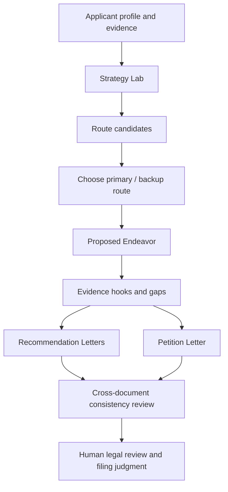

# NIW Prompt Library

**Language / 语言**: [中文](./README.md) | English

**Table of Contents**

- [What This Repo Is](#what-this-repo-is)
- [Prompt Catalog](#prompt-catalog)
- [NIW Workflow Map](#niw-workflow-map)
- [How To Use A Prompt](#how-to-use-a-prompt)
- [Current Prompt Card: niw.route_candidates](#current-prompt-card-niwroute_candidates)
- [Document Format](#document-format)
- [Repository Principles](#repository-principles)
- [Contributing Notes](#contributing-notes)
- [License And Use](#license-and-use)

## What This Repo Is

This is a prompt library for NIW and immigration strategy work. It collects practical prompts that help applicants, advisors, and builders reason more clearly about an NIW case: which strategy route to choose, how a Proposed Endeavor should be framed, what evidence is still missing, and how later Recommendation Letter / Petition Letter work should stay aligned.

This repo is not legal advice, and it is not meant to generate a complete petition in one shot. The prompts are designed to create structured intermediate artifacts so that each strategy decision is easier to review, verify, and iterate.

Each prompt document explains:

- where the prompt fits in the NIW workflow
- what artifact it is meant to generate
- what inputs it needs
- what output schema it follows
- how the result should be reviewed and used in the next step

## Prompt Catalog

| Prompt | Stage | Generates | Use it when |
| --- | --- | --- | --- |
| [`niw.route_candidates`](./niw-route-candidates.md) | Strategy Lab | 2 to 4 NIW route candidates with route mode, impact shape, scores, risks, and next actions | Use this early in case preparation when you are unsure which story line to lead with. It compares route tradeoffs, evidence proofability, and risk so you do not draft the PE, recommendation letters, or petition around a weak strategic spine. |

Planned additions:

| Planned prompt | Stage | Intended artifact |
| --- | --- | --- |
| `niw.proposed_endeavor` | Proposed Endeavor | Route-grounded PE outline and evidence plan |
| `niw.recommendation_letter` | Recommendation Letters | Referrer-specific letter body and coverage checklist |
| `niw.petition_letter` | Petition Letter | Petition theory, section drafts, and review plan |
| `niw.rubric_review` | Review | Structured review against NIW criteria |

## NIW Workflow Map

Current coverage: this repo currently documents the Strategy Lab route-generation prompt.

## How To Use A Prompt

1. Start from the Prompt Catalog and choose the prompt for your current NIW stage.
2. Read the prompt document before copying anything. Pay attention to its purpose, input contract, and output schema.
3. Prepare the required case materials. For `niw.route_candidates`, this means profile context, evidence inventory, existing PE titles if any, and existing routes if any.
4. Run the prompt in an LLM that can reliably return JSON.
5. Validate the output against the documented schema.
6. Review the result as a strategy artifact, not as a final legal conclusion.
7. Use the selected output to guide the next stage.

## Current Prompt Card: niw.route_candidates

`niw.route_candidates` supports the Strategy Lab stage. It helps compare different ways to frame the applicant's NIW strategy before writing a Proposed Endeavor.

It produces route candidates with:

- `route_mode`: the route type, selected from canonical labels
- `impact_shapes`: the kind of national-interest impact story
- `fit_score`: how well the route fits the current record
- `proofability_score`: how easy it is to support with available evidence
- `risk_score`: how risky the route is
- `why_primary`: why this route could anchor the case
- `top_risks`: concise risk codes
- `next_actions`: concrete follow-up moves

Read the full prompt and schema here: [`niw-route-candidates.md`](./niw-route-candidates.md).

## Document Format

Each prompt document should follow this structure:

1. Prompt name and version
2. Workflow stage
3. Purpose
4. Required inputs
5. Prompt text
6. Runtime JSON schema
7. Output field contract
8. How to review the output
9. How the output feeds the next stage

## Repository Principles

- Stage-specific: each prompt should belong to a clear NIW workflow step.
- Schema-first: important prompts should define structured output, not only free-form prose.
- Evidence-aware: prompts should separate applicant facts, public/domain evidence, future plans, and open gaps.
- No hidden certainty: prompts should surface risks and missing materials instead of smoothing them over.
- Human-reviewed: outputs should support attorney/user judgment, not replace it.

## Contributing Notes

When adding a prompt, include:

- `prompt_name`
- snapshot date
- source/version if copied from an app or production prompt manager
- the workflow stage it serves
- required inputs
- output schema or expected response shape
- one short example of how the output should be used

## License And Use

This repository is for prompt documentation and workflow design. Do not treat any generated output as legal advice or as a complete immigration filing strategy without qualified human review.
