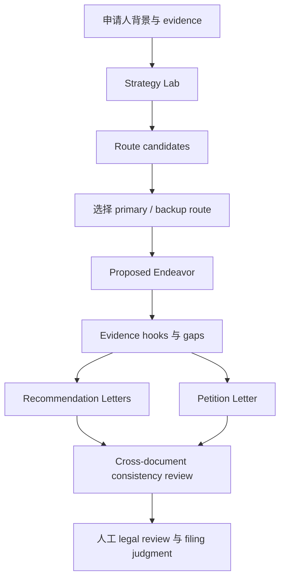

# NIW Prompt Library

**语言 / Language**: 中文 | [English](./README.en.md)

**目录**

- [这个 repo 是什么](#这个-repo-是什么)
- [Prompt 目录](#prompt-目录)
- [NIW 流程图](#niw-流程图)
- [如何使用一个 prompt](#如何使用一个-prompt)
- [当前 Prompt 卡片: niw.route_candidates](#当前-prompt-卡片-niwroute_candidates)
- [文档结构约定](#文档结构约定)
- [Repo 原则](#repo-原则)
- [贡献说明](#贡献说明)
- [许可与使用边界](#许可与使用边界)

## 这个 repo 是什么

这是一个面向 NIW / immigration strategy 的 prompt library。它收集和移民策略相关的 practical prompts，帮助申请人、顾问或 builders 更清楚地拆解一个 NIW case：应该选择哪条 strategy route、Proposed Endeavor 应该如何定义、哪些 evidence 还缺失、后续 Recommendation Letter / Petition Letter 应如何保持一致。

这个 repo 不是法律意见，也不是一键生成完整 petition 的工具。这里的 prompts 主要用于生成结构化的中间产物，让 strategy decision 更可审阅、可验证、可迭代。

每个 prompt 文档都会说明：

- 这个 prompt 服务 NIW 流程中的哪个阶段
- 它要生成什么内容
- 需要输入什么材料
- 输出 schema 是什么
- 结果应该如何被下一步使用

## Prompt 目录

| Prompt | 阶段 | 生成内容 | 适用场景 |
| --- | --- | --- | --- |
| [`niw.route_candidates`](./niw-route-candidates.md) | Strategy Lab | 2 到 4 条 NIW route candidates，包含 route mode、impact shape、scores、risks 和 next actions | 在材料准备早期判断“我到底该讲哪条故事线”，比较不同 route 的优缺点、evidence 可证明性与风险，避免一上来就写 PE / 推荐信 / petition 后才发现主线不稳。 |

计划补充：

| Planned prompt | 阶段 | 目标产物 |
| --- | --- | --- |
| `niw.proposed_endeavor` | Proposed Endeavor | Route-grounded PE outline 和 evidence plan |
| `niw.recommendation_letter` | Recommendation Letters | Referrer-specific letter body 和 coverage checklist |
| `niw.petition_letter` | Petition Letter | Petition theory、section drafts 和 review plan |
| `niw.rubric_review` | Review | 针对 NIW criteria 的 structured review |

## NIW 流程图

当前覆盖范围：本 repo 目前先记录 Strategy Lab 的 route generation prompt。

## 如何使用一个 prompt

1. 从 Prompt 目录选择你当前 NIW 阶段对应的 prompt。
2. 先读 prompt 文档，不要直接复制。重点看 purpose、input contract 和 output schema。
3. 准备所需 case materials。对 `niw.route_candidates` 来说，需要 profile context、evidence inventory、已有 PE titles，以及已有 routes。
4. 在能稳定返回 JSON 的 LLM 中运行 prompt。
5. 按文档里的 schema 校验输出。
6. 把结果当作 strategy artifact 来 review，而不是 final legal conclusion。
7. 用选定结果进入下一阶段。

## 当前 Prompt 卡片: niw.route_candidates

`niw.route_candidates` 服务 Strategy Lab 阶段。它用于在写 Proposed Endeavor 之前，比较几种不同的 NIW strategy framing。

它会生成 route candidates，每条包含：

- `route_mode`: route 类型，只能从 canonical labels 中选择
- `impact_shapes`: national-interest impact story 的形态
- `fit_score`: 当前 record 与这条 route 的匹配程度
- `proofability_score`: 这条 route 用现有 evidence 支撑的容易程度
- `risk_score`: route 风险，分数越高风险越高
- `why_primary`: 为什么这条 route 可以作为 case anchor
- `top_risks`: 简短 risk codes
- `next_actions`: 具体 follow-up moves

完整 prompt 和 schema: [`niw-route-candidates.md`](./niw-route-candidates.md)。

## 文档结构约定

每个 prompt 文档建议包含：

1. Prompt name 和 version
2. Workflow stage
3. Purpose
4. Required inputs
5. Prompt text
6. Runtime JSON schema
7. Output field contract
8. 如何 review output
9. Output 如何进入下一阶段

## Repo 原则

- Stage-specific: 每个 prompt 应该属于明确的 NIW workflow step。
- Schema-first: 重要 prompt 应该定义 structured output，而不是只输出自由文本。
- Evidence-aware: prompt 应区分 applicant facts、public/domain evidence、future plans 和 open gaps。
- No hidden certainty: prompt 应暴露风险和缺失材料，而不是把不确定性抹平。
- Human-reviewed: output 用来支持 attorney / user judgment，不替代人工判断。

## 贡献说明

新增 prompt 时，请包含：

- `prompt_name`
- snapshot date
- source / version，如果来自 app 或 production prompt manager
- 所属 workflow stage
- required inputs
- output schema 或 expected response shape
- 一个简短说明：这个 output 应如何被下一步使用

## 许可与使用边界

本 repo 用于 prompt documentation 和 workflow design。任何生成结果都不应被视为法律意见，也不应在没有 qualified human review 的情况下当作完整 immigration filing strategy 使用。
